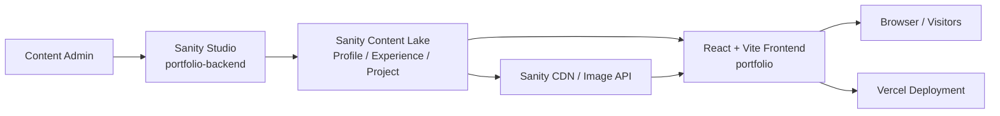

# Personal Portfolio

A content-driven personal portfolio built with React, Vite, Tailwind CSS, and Sanity. The project is split into two parts:

- `portfolio/` - the public-facing frontend
- `portfolio-backend/` - the Sanity Studio used to manage portfolio content

Live site: <https://tyron-bechayda.vercel.app>

## Overview

This repository powers a portfolio website that presents personal branding, skills, education, work experience, selected projects, and contact links in a single scrolling experience.

Instead of hardcoding most portfolio content in the UI, the frontend pulls data from Sanity at runtime. That makes the site easier to keep updated without editing React components every time profile details, work history, or projects change.

## Highlights

- Single-page portfolio experience with section-based navigation
- CMS-backed content using Sanity documents
- Animated UI built with Framer Motion
- Responsive project carousel
- Sanity image delivery with CDN-backed image URLs
- TypeScript-based frontend and content studio
- Lightweight Vite build pipeline for local development and production builds

## System Architecture

This project follows a headless CMS architecture:

1. Content is authored in Sanity Studio inside `portfolio-backend/`.
2. Sanity stores structured content in the hosted dataset.
3. The React frontend in `portfolio/` fetches profile, experience, and project documents directly from Sanity.
4. Sanity image assets are transformed into CDN URLs before rendering.
5. The frontend is deployed as a static site and consumes Sanity content at runtime.

### Architecture Diagram



### Runtime Data Flow

```text
Sanity Studio -> Sanity dataset -> frontend fetches documents -> images are preloaded -> sections render
```

### Architecture Notes

- There is no custom Express/Node API layer in this repository.
- The frontend talks directly to Sanity using `@sanity/client`.
- The main data aggregation happens in `portfolio/src/hooks/usePortfolio.ts`.
- The Sanity client and image URL builder live in `portfolio/src/data/sanity.ts`.
- Content types are defined in `portfolio-backend/schemaTypes/`.

## Tech Stack

### Frontend

- React 19
- TypeScript
- Vite
- Tailwind CSS 4
- Framer Motion
- React Multi Carousel
- Three.js / React Three Fiber
- Lucide React

### Content Management

- Sanity Studio
- Sanity Content Lake
- Sanity Vision

## Repository Structure

```text
personal-portfolio/
|-- README.md
|-- portfolio/
|   |-- public/
|   |-- src/
|   |   |-- assets/
|   |   |-- components/
|   |   |-- data/
|   |   |-- hooks/
|   |   |-- pages/
|   |   |-- types/
|   |   |-- App.tsx
|   |   `-- main.tsx
|   |-- package.json
|   |-- tsconfig.json
|   `-- vite.config.ts
`-- portfolio-backend/
    |-- schemaTypes/
    |-- sanity.config.ts
    `-- package.json
```

## Frontend Structure

The frontend is organized by responsibility:

- `src/pages/` - main portfolio sections such as hero, about, experience, projects, and contact
- `src/components/` - reusable UI pieces like loading states, cards, and scrolling visual components
- `src/hooks/` - data-fetching logic, currently centered on `usePortfolio`
- `src/data/` - Sanity client configuration and image URL helpers
- `src/types/` - shared TypeScript interfaces for portfolio content
- `src/assets/` - static SVGs and branding assets

## Main Sections of the Site

The portfolio renders the following major sections in `portfolio/src/App.tsx`:

- `Header` - top navigation with anchor links
- `Main` - hero section with profile image, availability status, role, and intro message
- `Skill` - animated scrolling skill display
- `About` - biography and education summary
- `Experience` - work timeline sorted by start date
- `Project` - project showcase carousel
- `Contact` - email, phone, social links, and project availability status

The app also uses a loading overlay that stays visible until Sanity data is fetched and key images are preloaded.

## Content Model

The Sanity Studio currently defines three main document types.

### 1. Profile

The `profile` document stores:

- Name and role
- Email and phone
- Intro message and about text
- Profile, about, and experience images
- Address information
- Availability statuses
- Social links
- Education details
- Skills with icons

### 2. Experience

The `experience` document stores:

- Numeric ID
- Company name
- Job role
- Bullet-point descriptions
- Start date
- End date

### 3. Project

The `project` document stores:

- Numeric ID
- Project name
- Description
- Technology tags
- Repository URL
- Project type
- Year
- Project image

## How Data Is Loaded

The frontend uses the `usePortfolio` hook to fetch content from Sanity:

- One `profile` document
- All `experience` documents
- All `project` documents

These are combined into a single `PortfolioData` object and passed down into the section components. Images are converted to usable URLs through the Sanity image builder and preloaded before the main UI becomes visible.

## Local Development

### Prerequisites

- Node.js 18+ recommended
- npm
- A Sanity account if you want to edit or deploy studio content

### Run the Frontend

```bash
cd portfolio
npm install
npm run dev
```

Useful frontend scripts:

- `npm run dev` - start the Vite dev server
- `npm run build` - type-check and create a production build
- `npm run preview` - preview the production build locally
- `npm run lint` - run ESLint
- `npm run typecheck` - run TypeScript checks without building

### Run the Sanity Studio

```bash
cd portfolio-backend
npm install
npm run dev
```

Useful studio scripts:

- `npm run dev` - start the Sanity Studio locally
- `npm run build` - build the studio
- `npm run deploy` - deploy the studio
- `npm run deploy-graphql` - deploy Sanity GraphQL configuration

## Configuration Details

### Frontend

- Vite is configured in `portfolio/vite.config.ts`
- The `@` alias points to `portfolio/src`
- Tailwind is integrated through the Vite plugin

### Sanity

- The Sanity Studio is configured in `portfolio-backend/sanity.config.ts`
- The frontend client is configured in `portfolio/src/data/sanity.ts`
- The current Sanity project ID is `ubpspdu3`
- The current dataset is `production`
- The frontend uses the Sanity CDN with `useCdn: true`

## Deployment

The live portfolio is deployed at:

- <https://tyron-bechayda.vercel.app>

Typical deployment flow:

1. Update content in Sanity Studio.
2. Push frontend changes to the repository.
3. Vercel builds and deploys the React frontend.
4. The deployed site reads the latest published Sanity content at runtime.

## Design and UX Notes

- The project uses motion-heavy section reveals and transitions.
- Images are visually important and are preloaded before the main content is shown.
- The experience section sorts entries in the UI rather than relying on backend ordering.
- The projects section uses a responsive carousel for mobile, tablet, and desktop layouts.

## Potential Improvements

- Move Sanity client settings to environment variables
- Add explicit GROQ queries with ordering and field selection
- Add loading and error UI for failed content fetches
- Add automated tests for data loading and section rendering
- Document deployment steps for both frontend and studio in more detail
- Add CI checks for linting and type safety

## Website Screenshot / Demo

If you want to document this project further, a good next step would be adding:

- Screenshots of each section
- A short GIF walkthrough
- A content editing guide for Sanity Studio
- Deployment badges and status checks

## License

No license is currently defined in the root project. The Sanity Studio package is marked as `UNLICENSED`.
